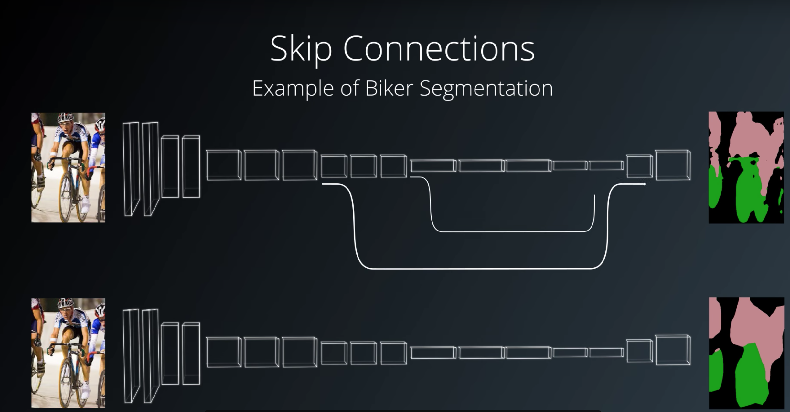

## Deep Learning Project

---

### Network Architecture

#### 1. Explain each layer of the network architecture and the role that it plays in the overall network.

The semantic segmentation network architecture was constructed by the encoder blocks, Fully Convolutional Network (FCN) and decoder blocks. For this project I use 7 layers, three encoding layers, one 1 x 1 convolutional layer, and three decoding layers. The Last layer in FCN is regular convolution layer with softmax activation and same padding. All convolutions are supported by batch normalisation. The code for Network architecture can be found in task cell six of the `model_training.ipynb` notebook.

| layers        | dimension           | depth  |
| ------------- |:-------------:| -----:|
| input layer | 160 * 160 | 3 |
| encoder 1 | 80 * 80 | 32 |
| encoder 2 | 40 * 40 | 64 |
| encoder 3 | 20 * 20 | 128 |
| 1 x 1 layer | 20 * 20 | 128 |
| decoder 1 | 40 * 40 | 128 |
| decoder 2 | 80 * 80 | 64 |
| decoder 3 | 160 * 160 | 32 |

##### Encoder

The encoder block architecture is constructed as follows. All convolutions, and separable convolutions use 'same' padding and are accompanied by batch normalisation.   

   
The encoder portion is a convolution network that reduces to a deeper 1x1 convolution layer and the output tensors height and width will be half of the input tensor. This is performed to utilise the convolutional feature extraction properties on the input image.     


##### Separable Convolutions    

Separable Convolutions is a technique that reduces the number of parameters needed, thus increasing efficiency for the encoder network. Each includes batch normalization with the ReLU activation function applied to the layers.
The code for the encoder block can be found in the cell four and five of the `model_training.ipynb` notebook.

##### FCN

After the *Encoder module*, the resulting convolution is passed through a *Fully Convolutional Network* (FCN). FCN's are discussed in more detail in section three, *Describe where/when/how a fully connected layer should be used.*
    

##### Decoder

Each decoder block upsamples the input data, doubling the height and width of the data. The decoder block is comprised of three parts:

 * A bilinear upsampling layer using the upsample_bilinear() function. The current recommended factor for upsampling is set to 2.
 * A layer concatenation step. This step is similar to skip connections. You will concatenate the upsampled small_ip_layer and the large_ip_layer.
 * Some (one or two) additional separable convolution layers to extract some more spatial information from prior layers. The code for the decoder block can be found in the task block six of the `model_training.ipynb` notebook.   
Each *Decoder Block* architecture is shown below. Note all separable convolutions use 'same' padding and are followed by batch normalisation. 
    
    
    

##### Skip connections

Skip connections are used to help retain spatial information of the input data.

    

#### 2. Explain the neural network parameters including the values selected and how these values were obtained.

##### Model parameters

The model parameters like network depth, kernel's and stride sizes were derived from this paper [Xception: Deep Learning with Depthwise Separable Convolutions](https://arxiv.org/abs/1610.02357)
In this paper, the segmentation convolution kernel size used was 3x3. As the papers have both had extensive research performed on the model, my model would also use kernel size of 3x3.

In the paper, the filter sizes start at 32 and increase in each layer by a factor of either four or two based on the previous filter count. However, as the simulator environment is not detail-rich, a filter size of 16 was chosen and with an increase factor of two used between layers.

##### Hyper-parameters

I used 10 workers to fully utilize the power of Intel i7 processor cores. On my Laptop, when I used batch size of 64, 50 I was getting "ResourceExhaustedError : OOM when allocating tensor with shape.." error. I was able to resolve it after reducing the batch size down to 40. For the learning rate I started at 0.01 and go down by 0.001 each time. Every time I tried to go below 0.001 but did not see an increase in final score.

After sample testing hyper-parameters, values were chosen that accounted for the network limitations performance requirements and a more extensive training run was performed.

The final hyper parameters are:     

```
learning_rate = 0.001   
batch_size = 40   
num_epochs = 40   
steps_per_epoch = 200
validation_steps = 50
workers = 10
```

The model hyper-parameters can be found in the task cell eight of the `model_training.ipynb` notebook.

#### 3. Describe where/when/how a fully connected layer should be used.

The FCN is the block between the encoder and decoder networks. An FCN is a 1x1 convolution which retains image spacial data compared with Dense layer. It is used whenever a classification layer is required that is required to retain spatial information in the network.

#### 4. Identify the use of various reasons for encoding/decoding images, when it should be used, why it is useful, and any problems that may arise.

The encoder portion is a convolution network that reduces to a deeper 1x1 convolution layer. Encoding of images is used to extract features from the data for classification. The decoder is used to upsample the transformed features into the desired network output during each encoding layer, spatial data is lost from the previous layer.

During the upsampling of the data in each decoder stage, each new pixel value is calculated by the weighted average of-of the four nearest neighbours. This results in a diminishing sharpness of objects in the data.
Both the loss of spatial data and demonising sharpness can be reduced by using skip connections.

#### 5. Articulate whether this model and data would work well for following another object (dog, cat, car, etc.) instead of a human and if not, what changes would be required.

If Image data was collected of other objects, the current network architecture trained on a different data set should work just as well as the tested human mode.

### Model

#### 1. The model is submitted in the correct format.

The trained model, `model_weights`, can be found in the folder `data/weights/`.

To run the model in the simulator, navigate to the repositories location and into the folder `code/` and run the `follow.py` file with the weights file as the argument.

```sh
python follower.py model_weights
```

#### 2. The neural network obtains an accuracy greater than or equal to 40% (0.40) using the Intersection over Union (IoU) metric.

The total IoU accuracy of the network was calculated under three different scenarios as follow:

###### 1. While following the target.

The output images are as follow:


The evaluation score of the above test set:

 * number of validation samples IoU evaulated on **542**
 * average IoU for background is **0.9963171030194158**
 * average IoU for other people is **0.39053705677884215**
 * average IoU for the hero is **0.919115807430998**
 * true positives: **539**
 * false positives: **0**
 * false negatives: **0**

###### 2. While on patrol detect the target from far away.


The evaluation score of the above test set:

 * number of validation samples IoU evaulated on **322**
 * average IoU for background is **0.9968681611643959**
 * average IoU for other people is **0.4788112615450142**
 * average IoU for the hero is **0.22303847353081538**
 * true positives: **123**
 * false positives: **2**
 * false negatives: **178**

###### 3. While on patrol without target.


The evaluation score of the above test set:

 * number of validation samples IoU evaulated on **270**
 * average IoU for background is **0.9894182318647599**
 * average IoU for other people is ** 0.7842698166526806**
 * average IoU for the hero is **0.0**
 * true positives: **0**
 * false positives: **46**
 * false negatives: **0**

###### Final results

The final result is calculated by the average IoU of correct hero identification, excluding datasets without the hero, multiplied by the total true positives divided by the sum of the true positives, false negatives and false positives. The final resulting IoU of the network is **0.4257354358089642** while the final Intersection over Union of **0.5710771404809066**

### Future work

* Changing learning rate can be helpful in reducing learning time.
* Collect more training data in varying positions and environments and train the model on the large dataset like Add more images of "While on patrol detect the target from far away" status.
* Adding more layers helps in capture more contexts and improve accuracy of segmentation.


### Demo

#### 1. The vehicle must successfully drive a lap around the track. No tire may leave the drivable portion of the track surface. The car may not pop up onto ledges or roll over any surfaces that would otherwise be considered unsafe (if humans were in the vehicle).   

[](https://youtu.be/8uRiiSYJZGA) 
